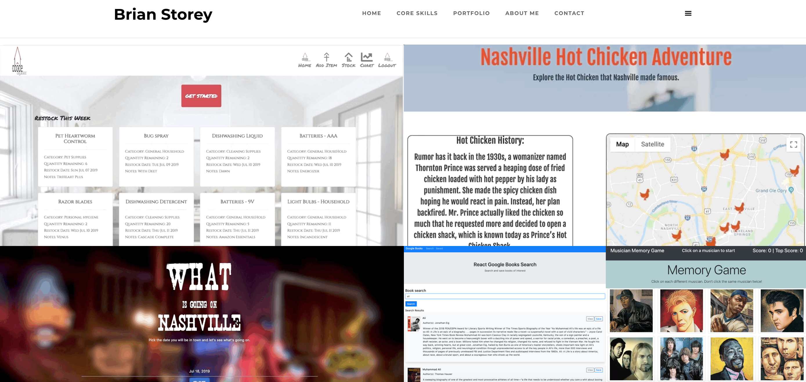

# Portfolio

## Contributors
@bwillstorey

## Technology
- Javascript, React, Node.js, Express, MongoDB, mySQL, HTML5, CSS3, Bootstrap, jQuery, AJAX, APIs, Firebase
- Live Demo: https://brianstorey.me

## About
A personal development portfolio highlighting a variety of tools and technologies including Javascript, React, Express, Node, MongoDB, mySQL, AJAX, APIs, Bootstrap. Current projects include a home organizer, an application highlighting hot chicken restaurants, various happenings around Nashville, a Google Books search tool, a React memory game, an NPR web scraper, a node/express burger application utilizing handlebars, a scuba dive buddy finder, an Amazon-like node app, a SIRI-like node app, a train scheduler, a hangman game, a gif creator, a hidden number guess game, and a timed trivia game. Additional content forthcoming!

### Portfolio
  

## Contributing Guidelines
All contributions and suggestions are welcome! For direct contributions, please fork the repository and file a pull request.

## Contact
#### Developer/Full-stack Web Software Developer
- Homepage: https://brianstorey.me
- email: bwillstorey@gmail.com
- LinkedIn: https://www.linkedin.com/in/brianstorey/